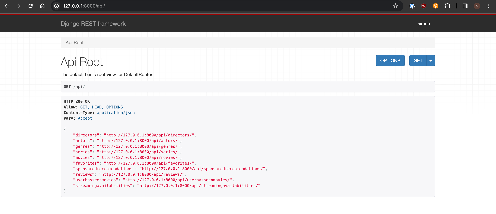

# Programvareutvikling TDT4140 2024v Gruppe 58

## "Netflix"-app

## Description

"Netflix"-app utviklet av meg og andre studenter ved ntnu i faget TDT4140 våren 2024. Følg instruksjonen under for oppsett

## Installation

1. Clone the repository using SSH or HTTPS

```bash
git clone <repo link>
cd <repo-name>
```

### Backend

1. Have python installed and in **PATH**.
2. Create virtual environment:

```bash
python -m venv venv #Might need to use python3
```

3. Source environment:

```bash
source venv/bin/activate #For macOS
.\venv\Scripts\activate #For Windows
```

4. Install requirements:

```bash
pip install -r requirements.txt
```

### Frontend

1. Download Node.js

## Usage

### Backend:

1. Navigate to backend

```bash
cd backend
```

2. Ensure up-to-date migrations

```bash
python manage.py makemigrations
python manage.py migrate
```

3. Run the server

```bash
python manage.py runserver
```

Now the backend is running and you can make requests to the default url: http://127.0.0.1:8000/api/

Example of how the UI should look:


To access the admin panel go to http://127.0.0.1:8000/admin. This will require a superuser:

```bash
python3 manage.py createsuperuser
```

4. Populate with a bunch of dummy data (3886 movies). Source: [Kaggle](https://www.kaggle.com/code/kerneler/starter-movie-dataset-8742e7a3-6/input)

In `backend` run

```bash
python manage.py populate_db data_200.csv
```

### Frontend

Make sure you have Node.js and Bun installed. For Windows don't use Bun, use npm instead (Already installed with Node.js)

Check it with:

```bash
node -v
bun -v # Alternatively npm -v for Windows
```

1. Navigate to frontend

```bash
cd frontend
```

2. Install dependencies

```bash
bun install # Or npm install
```

3. Start the app

```
bun start # Or npm start
```

For the API fetching to work you need to be running the Django backend in a separate tab in the terminal as shown [above](#backend-1). You will also not get anything showing if you dont create the dummy-data in the admin site or using post requests.

## Authors

Written by:
Isak Olav Sjøberg, Simen Kristiansen Sandhaug, Aksel Normann Antonsen, Nora Aasbø Heiberg, Elin Arna Sigthorsdottir, Kaja Loennecken, Magnus Fylling Vik.
